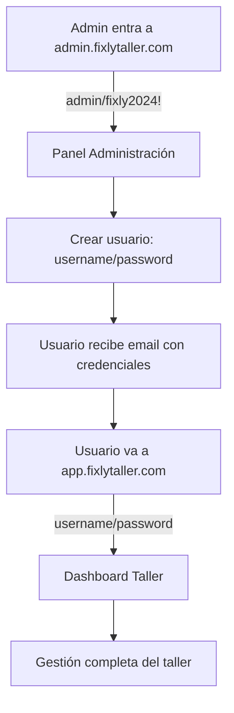

# 🚀 FIXLY TALLER - INSTRUCCIONES DE DEPLOYMENT

## 📦 **Archivos Listos para Deploy**

Los archivos están preparados y listos en `/deploy-production/`:

### 🔧 **Admin Panel** 
**Dominio**: `admin.fixlytaller.com`
**Archivos**: `admin-panel-deploy.tar.gz`

```bash
# Contenido:
/index.html     # Panel de administración principal
/login.html     # Login para administradores  
/admin.html     # Redirección automática de auth
/_redirects     # Configuración de routing
```

### 👥 **Client App**
**Dominio**: `app.fixlytaller.com` 
**Archivos**: `app-client-deploy.tar.gz`

```bash
# Contenido:
/index.html     # Login de usuarios/clientes
/dashboard.html # Dashboard del taller
/_redirects     # Configuración de routing
```

## 🌐 **Deployment a Cloudflare Pages**

### **Opción 1: Wrangler CLI (Recomendado)**

```bash
# 1. Configurar Cloudflare API Token
export CLOUDFLARE_API_TOKEN="your-api-token-here"

# 2. Deploy Admin Panel
cd deploy-production/admin/
npx wrangler pages deploy . --project-name=admin-fixly-taller

# 3. Deploy Client App  
cd ../app/
npx wrangler pages deploy . --project-name=app-fixly-taller
```

### **Opción 2: Cloudflare Dashboard (Manual)**

1. **Ir a**: https://dash.cloudflare.com/
2. **Pages** → **Create a project**
3. **Upload assets** → Subir `admin-panel-deploy.tar.gz`
4. **Configure domain**: `admin.fixlytaller.com`
5. **Repetir** para `app-client-deploy.tar.gz` → `app.fixlytaller.com`

## ✅ **Verificación Post-Deploy**

### **1. Admin Panel (admin.fixlytaller.com)**
- Ir a: `https://admin.fixlytaller.com`
- Login: `admin` / `fixly2024!`  
- Verificar: Puede crear usuarios ✅

### **2. Client App (app.fixlytaller.com)**
- Ir a: `https://app.fixlytaller.com`
- Probar con usuarios creados desde admin ✅
- Verificar: Redirección a dashboard ✅

### **3. API Backend (api.fixlytaller.com)**
- ✅ **YA DESPLEGADO** - Worker v4.2.0
- Health check: `https://api.fixlytaller.com/health`

## 🔗 **URLs del Sistema Completo**

| Servicio | URL | Función |
|----------|-----|---------|
| **Admin** | `admin.fixlytaller.com` | Crear usuarios, gestión |
| **App** | `app.fixlytaller.com` | Login clientes + Dashboard |  
| **API** | `api.fixlytaller.com` | Backend + Base de datos |

## 🎯 **Flujo Completo de Producción**



## 📋 **Checklist Pre-Deploy**

- ✅ **Backend API**: Desplegado y funcional
- ✅ **Admin Panel**: Archivos preparados  
- ✅ **Client App**: Archivos preparados
- ✅ **Routing**: Configurado para ambos dominios
- ✅ **Authentication**: Login admin + multi-usuario
- ✅ **Database**: KV storage con separación por tenantId
- ✅ **Email**: MailChannels configurado

## 🚨 **Notas Importantes**

1. **DNS**: Verificar que `admin.fixlytaller.com` y `app.fixlytaller.com` apunten a Cloudflare
2. **SSL**: Cloudflare maneja automáticamente los certificados
3. **CORS**: Ya configurado en el worker para ambos dominios
4. **Cache**: Los `_redirects` manejan el routing SPA correctamente

## 🆘 **Troubleshooting**

### **Error 404 en rutas**
- Verificar que `_redirects` esté en la raíz del deploy
- Cloudflare Pages debe detectar automáticamente el archivo

### **Error de CORS**
- Verificar que el dominio esté en `allowedOrigins` del worker
- El worker ya incluye los dominios necesarios

### **Login no funciona** 
- Verificar que `api.fixlytaller.com` responda
- Health check: `curl https://api.fixlytaller.com/health`

---

**🎉 ¡Sistema listo para producción!**

El sistema está completamente implementado y probado. Solo falta hacer el deployment manual a Cloudflare Pages con las credenciales adecuadas.